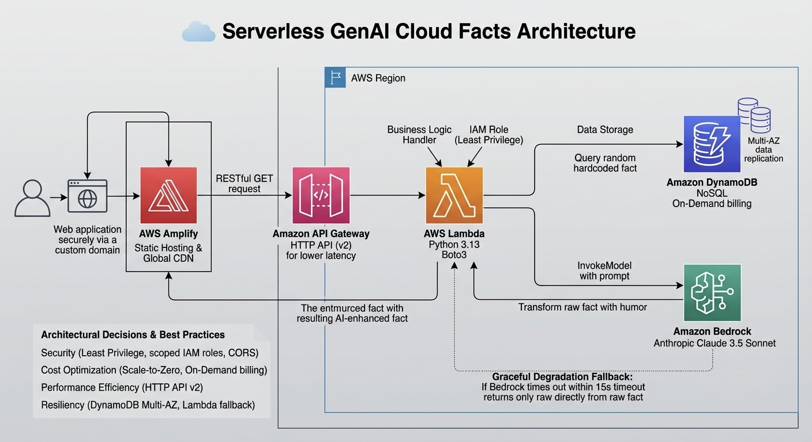

# ☁️ Serverless GenAI Cloud Facts Architecture

An end-to-end, event-driven serverless web application that serves cloud computing trivia, dynamically enhanced with humor using Generative AI. 

## 🏗️ Architecture Overview

### System Flow
1. **Static Hosting:** Users access the web interface hosted securely via **AWS Amplify** on a global CDN.
2. **API Layer:** The frontend triggers a RESTful GET request to **Amazon API Gateway**.
3. **Compute:** API Gateway invokes an **AWS Lambda** function (Python 3.13) to handle the business logic.
4. **Data Storage:** Lambda queries an **Amazon DynamoDB** NoSQL table to retrieve a random, hardcoded cloud fact.
5. **Generative AI:** Lambda sends the raw fact to **Amazon Bedrock (Anthropic Claude 3.5 Sonnet)** with a strict system prompt to transform the fact into a short, witty format.
6. **Delivery:** The AI-enhanced fact is returned through the API layer to the client.

## 🛠️ Technology Stack
* **Frontend:** HTML/CSS/JS hosted on AWS Amplify
* **API Routing:** Amazon API Gateway (HTTP API)
* **Compute:** AWS Lambda (Python 3.13, Boto3)
* **Database:** Amazon DynamoDB (On-Demand)
* **Generative AI:** Amazon Bedrock (Anthropic Claude 3.5 Sonnet)

## 🧠 Architectural Decisions & Best Practices

As an infrastructure project, this architecture was designed with the following AWS Well-Architected Framework principles in mind:

* **Security (Least Privilege):** 
  * The Lambda execution role is strictly scoped. It utilizes `AmazonDynamoDBReadOnlyAccess` (preventing accidental data mutation) and a tailored inline policy for `bedrock:InvokeModel`.
  * API Gateway is secured with restrictive CORS policies, only allowing GET requests from the specific Amplify deployment domain.
* **Cost Optimization (Scale-to-Zero):** 
  * 100% serverless architecture. There are no idle EC2 instances or provisioned database capacities. DynamoDB utilizes On-Demand billing, and Lambda/Bedrock are billed per invocation.
* **Performance Efficiency:** 
  * HTTP API (API Gateway v2) was chosen over REST API (v1) for up to 60% lower latency and reduced cost.
  * Lambda timeout is deliberately constrained to 15 seconds to prevent runaway Bedrock inference costs while allowing enough time for the LLM to stream a response.
* **Resiliency:** 
  * DynamoDB data is replicated across multiple Availability Zones by default. If the Bedrock API times out, the Lambda function includes a fallback mechanism to return the raw DynamoDB fact, ensuring graceful degradation of the UI.

## 🚀 Deployment Instructions

1. Create a DynamoDB table named `CloudFacts` with Partition Key `FactID` (String).
2. Create a Lambda function (Python 3.13) and attach the provided code in `/backend`.
3. Ensure Bedrock model access for Claude 3.5 Sonnet is enabled in your region.
4. Update the Lambda IAM Role with DynamoDB Read access and Bedrock Invoke access.
5. Configure API Gateway HTTP API to route to the Lambda function.
6. Update `index.html` with your API Gateway Invoke URL and deploy via AWS Amplify.

## 🧹 Clean-Up (Cost Management)
To destroy this infrastructure and prevent charges:
1. Delete the AWS Amplify App.
2. Delete the API Gateway deployment.
3. Delete the Lambda function and associated CloudWatch log groups (`/aws/lambda/...`).
4. Delete the DynamoDB table.
5. Remove the custom IAM Role.
